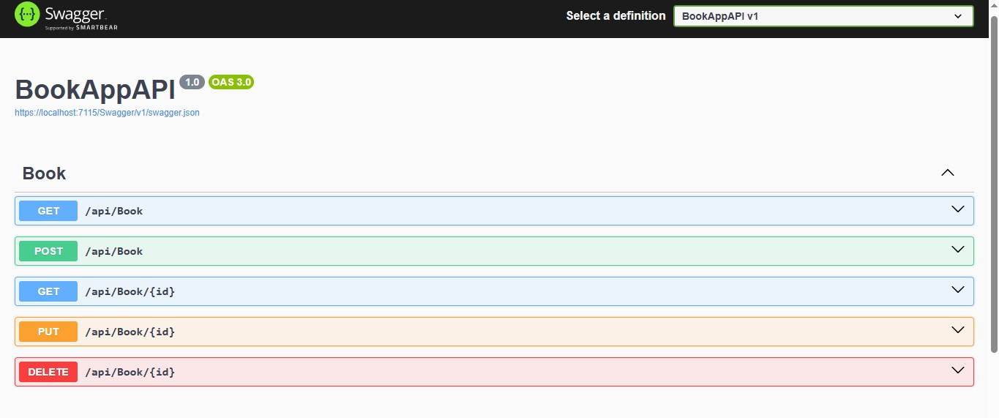

<h1>Create a simple .NET Web API that manages a list of books.</h1>

The API have the following endpoints:

<ul>
  <li>GET /api/books - Returns all books</li>
  <li>GET /api/books/{id} - Returns a specific book by ID</li>
  <li>POST /api/books - Adds a new book</li>
  <li>PUT /api/books/{id} - Updates an existing book</li>
  <li>DELETE /api/books/{id} - Deletes a book</li>
</ul>

Each book has: Id, Title, Author, and Year properties.

